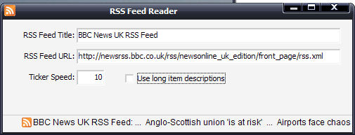



## RSS Feed Ticker

### Description

This is a quick example of implementing an RSS Feed reader on a 'ticker' style message on your applications. The code's commented and easy to understand. You can do this easier in VS .NET (or by using a Marquee control in a WebBrowser), but I thought it might be neat (and useful) to do it in vanilla VB using the MSXML library.
 
### More Info
 

             |
---                |---
**Submitted On**   |2007-01-13 07:40:02
**By**             |[James Kerr](https://github.com/Planet-Source-Code/PSCIndex/blob/master/ByAuthor/james-kerr.md)
**Level**          |Intermediate
**User Rating**    |5.0 (20 globes from 4 users)
**Compatibility**  |VB 6\.0
**Category**       |[Internet/ HTML](https://github.com/Planet-Source-Code/PSCIndex/blob/master/ByCategory/internet-html__1-34.md)
**World**          |[Visual Basic](https://github.com/Planet-Source-Code/PSCIndex/blob/master/ByWorld/visual-basic.md)
**Archive File**   |[RSS\_Feed\_T2042341132007\.zip](https://github.com/Planet-Source-Code/james-kerr-rss-feed-ticker__1-67615/archive/master.zip)

